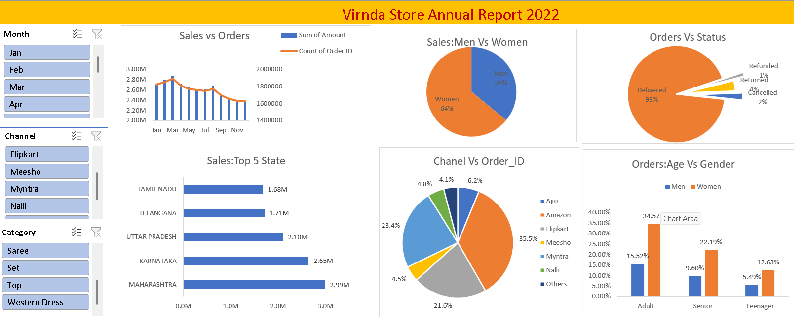

# Vrinda Store Data Analysis 2022

## 📊 Project Overview

Vrinda Store Data Analysis is an **Excel-based sales data analytics project** focused on analyzing **Vrinda Store's 2022 sales data**.

The project uses Microsoft Excel to clean, analyze, visualize, and present sales and order data through **Pivot Tables, Pivot Charts, and an interactive dashboard**.

The analysis provides insights into customer demographics, sales performance, order status, top-performing states, sales channels, and monthly trends.

---

## 🎯 Project Objectives

* Analyze Vrinda Store sales and orders for 2022
* Understand customer purchasing behavior
* Compare sales contribution by gender
* Analyze monthly sales and order trends
* Identify top-performing states
* Analyze order status and fulfillment performance
* Compare sales channels based on orders
* Understand age and gender-wise order patterns
* Create an interactive Excel dashboard
* Generate useful business insights from sales data

---

## 🛠️ Tools & Technologies

* **Microsoft Excel**
* Pivot Tables
* Pivot Charts
* Excel Functions
* Data Cleaning
* Data Analysis
* Data Visualization
* Interactive Dashboard
* Slicers

---

## 📈 Dashboard Analysis

The dashboard contains the following major analysis sections:

### 1. Sales vs Orders

Monthly sales revenue and order count are analyzed to understand sales performance and order trends throughout 2022.

### 2. Sales: Men vs Women

The dashboard compares sales contribution by gender:

* **Women: 64%**
* **Men: 36%**

This indicates that women customers contributed a higher share of sales compared with men.

### 3. Orders vs Status

Order status is analyzed across:

* Delivered
* Cancelled
* Returned
* Refunded

This helps understand order fulfillment and post-order performance.

### 4. Sales: Top 5 States

The dashboard highlights the top-performing states:

* Maharashtra
* Karnataka
* Uttar Pradesh
* Telangana
* Tamil Nadu

These states represent important markets for Vrinda Store.

### 5. Channel vs Order ID

Orders are compared across different sales channels, including:

* Amazon
* Flipkart
* Myntra
* Meesho
* Other channels

This analysis helps understand the contribution of different sales platforms.

### 6. Orders: Age vs Gender

Customer orders are analyzed by:

* Adult
* Senior
* Teenager

The dashboard further compares these age groups by gender to understand customer demographics.

---

## 💡 Key Insights

Based on the **Vrinda Store 2022 sales dashboard**, the analysis highlights the following insights:

* **Women customers contributed 64% of sales**, compared with 36% from men.
* Monthly sales and order analysis helps identify changes in sales performance throughout 2022.
* The order-status analysis provides visibility into Delivered, Cancelled, Returned, and Refunded orders.
* **Maharashtra, Karnataka, Uttar Pradesh, Telangana, and Tamil Nadu** are highlighted as the top 5 states by sales.
* Amazon, Flipkart, Myntra, Meesho, and other channels are compared to understand channel-wise order performance.
* Age and gender analysis helps identify purchasing patterns among Adults, Seniors, and Teenagers.
* Interactive slicers allow users to analyze the data by **Month, Channel, and Category**.

---

## 🎛️ Interactive Dashboard

The dashboard includes interactive slicers for:

* **Month**
* **Channel**
* **Category**

These slicers allow users to filter the dashboard and perform focused analysis based on specific business requirements.

---

## 📊 Dashboard Preview



---

## 📂 Project Structure

```text
Vrinda-Store-Data-Analysis/
│
├── data/
│   └── Vrinda_Store_Data_Analysis.xlsx
│
├── images/
│   └── vrinda_store_dashboard.png
│
├── README.md
└── .gitignore
```

---

## 💼 Skills Demonstrated

* Data Cleaning
* Data Analysis
* Microsoft Excel
* Pivot Tables
* Pivot Charts
* Data Visualization
* Dashboard Development
* Business Intelligence
* Business Insights
* Interactive Data Analysis

---

## 📌 Conclusion

The **Vrinda Store Data Analysis 2022** project demonstrates how raw sales data can be transformed into meaningful business insights using Microsoft Excel.

The analysis provides a clear view of **sales trends, customer demographics, gender-wise sales, order status, top-performing states, and sales channels**.

The interactive dashboard makes it easier to explore the data using Month, Channel, and Category filters and supports **data-driven business decision-making**.

---

## 👨‍💻 Project Author

**Deepak Kumar Sah**

**Aspiring Data Analyst | Excel | SQL | Python | Power BI**
